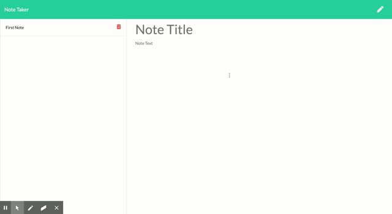

# MVC-NoteTaker

## Description

NoteTaker is an application that uses an express backend to write, save, and delete notes in order to allow the user to organize their thoughts and keep track of tasks that they need to complete. 

This application utilizes the MVC Framework, ORMs, and MySQL. It also requires the Dot ENV package to hide sensitive pieces of information from the source code. 

## Table of Contents
  
[Installation](#installation)
  
[Usage](#usage)
  
[Demo](#demo)

[License](#license)

## Installation

1. Clone this repository.
2. Navigate to the Develop folder in the terminal.
3. Run  `<npm init>`  to create a package.json file. If you would like to skip the prompted questionnaire, you may run  `<npm init -y>`  instead. 
4. Run  `<npm install>`  to install all the dependencies. 
5. To access the application locally, run  `<node server.js>` , then input  `localhost:8080`  into the browser. If the 8080 port is already in use, run `< killall -9 node>` in order to access the port. 
6. To access the application that has been deployed on Heroku, **[click here](https://still-brook-44813.herokuapp.com/)**.

## Usage

After opening the application using your desired method, click  **`Get Started`**  on the homepage. You will be taken to a new page that allows you to write, save, and delete your notes. 

## DEMO

## License 
  
Licensed under the MIT license. 